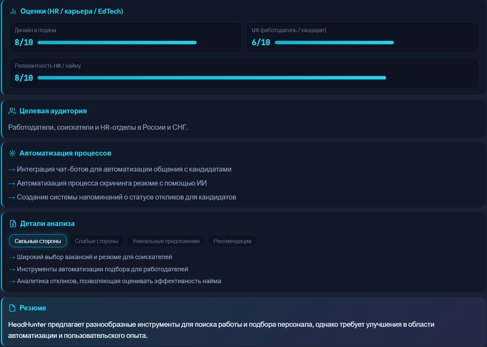
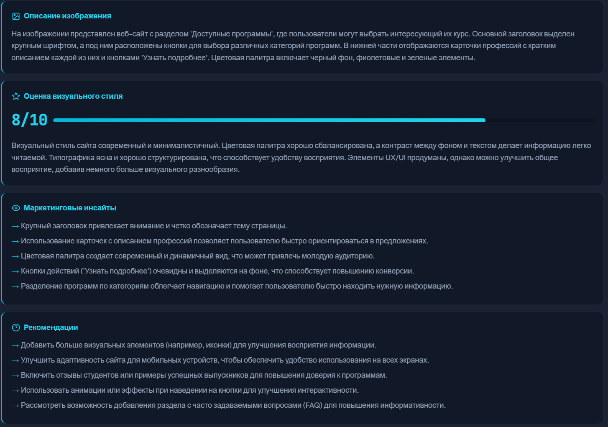
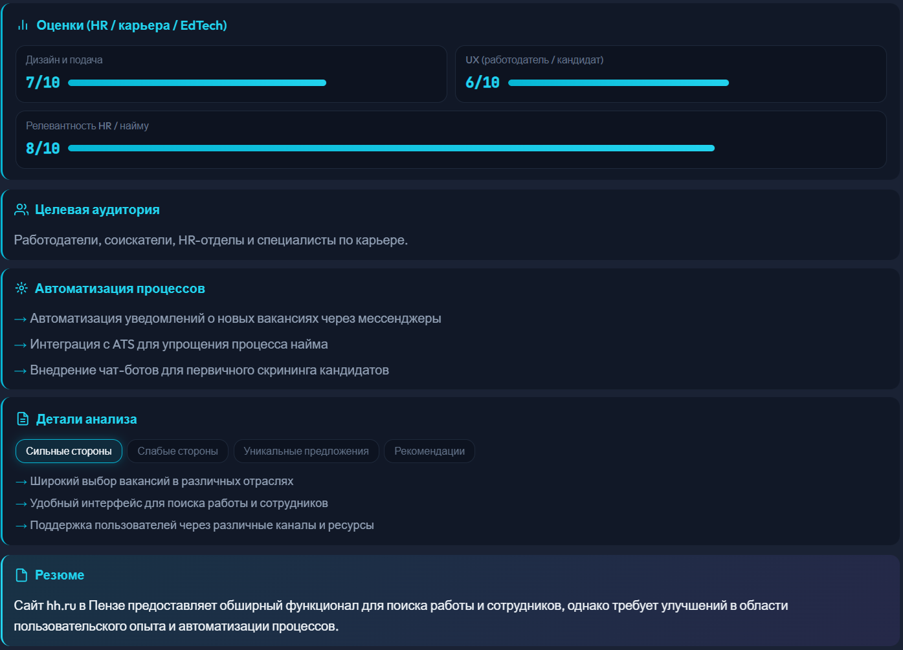
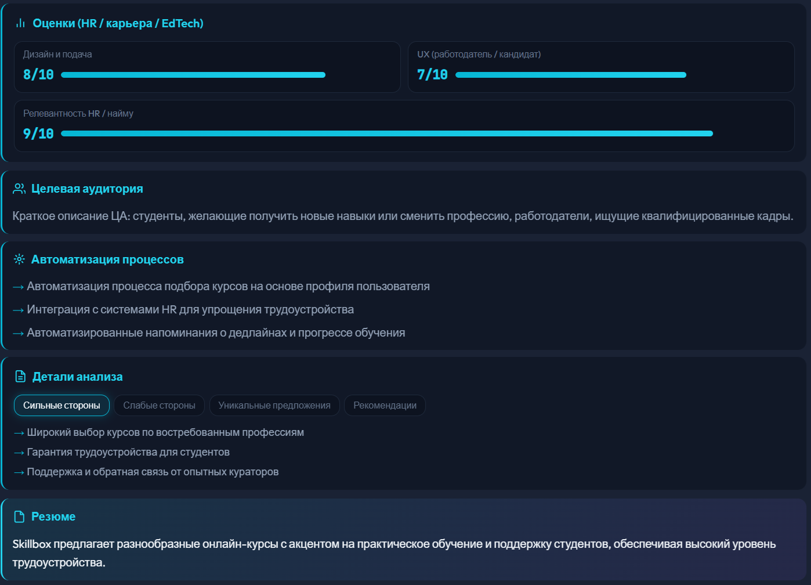
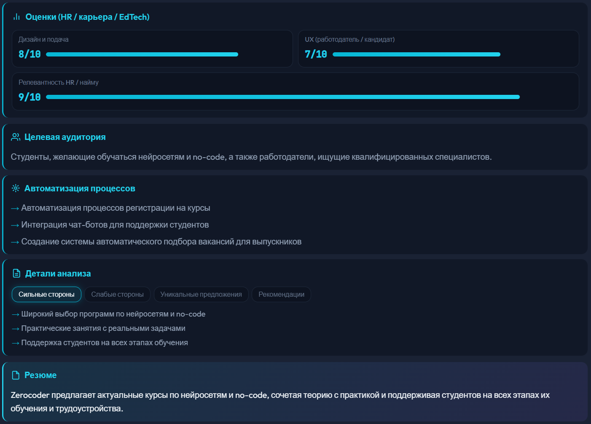

# 🔍 Мониторинг конкурентов - AI Ассистент

MVP приложения для анализа конкурентной среды: текст, изображения и страницы сайтов (ниша HR / карьера / EdTech).


-purple.svg)

## 🖼 Портфолио — примеры работы

## 📊 Сравнение конкурентов

| Сервис | Design | UX | HR relevance |
|---|---:|---:|---:|
| hh.ru | 8 | 7 | 9 |
| Zerocoder | 8 | 7 | 8 |
| Skillbox | 8 | 7 | 9 |
| Habr | 8 | 7 | 6 |

Ниже — превью веб-интерфейса (файлы лежат в `screenshots/` в корне репозитория).

| Режим | Скриншот |
|--------|----------|
| Анализ текста | [](screenshots/text_analysis_preview.png) |
| Анализ изображения | [](screenshots/image_analysis_preview.png) |
| Парсинг сайта (HH) | [](screenshots/site_hh_preview.png) |
| Парсинг сайта (Skillbox) | [](screenshots/site_skillbox_preview.png) |
| Парсинг сайта (Zerocoder) | [](screenshots/site_zerocoder_preview.png) |

## 📋 Описание

Приложение позволяет:

- **Анализировать текст конкурентов** — структурированная аналитика: сильные/слабые стороны, УТП, рекомендации, резюме и **единая HR/EdTech-оценка** (баллы и поля ниже).
- **Анализировать изображения** — баннеры, скриншоты, визуальные материалы: описание, маркетинговые инсайты, оценка визуального стиля (0–10), рекомендации.
- **Парсить сайты через Selenium + Chrome** — загрузка страницы, **скриншот**, **видимый текст**, затем **анализ через LLM** (тот же конкурентный отчёт, что и для текста).
- **Хранить историю** — последние запросы сохраняются для быстрого доступа.

### Единая модель оценки (текст и результат парсинга сайта)

Ответ `CompetitorAnalysis` включает:

- `design_score`, `ux_score`, `hr_relevance_score` (0–10)
- `target_audience` — целевая аудитория (работодатели, кандидаты, EdTech и т.д.)
- `automation_potential` — идеи автоматизации HR/рекрутинга
- плюс списки сильных/слабых сторон, УТП, рекомендаций и `summary`

## 🚀 Быстрый старт

### 1. Клонирование и установка зависимостей

```bash
# Перейдите в каталог проекта
cd competitor-monitor

# Создайте виртуальное окружение
python -m venv venv

# Активируйте окружение
# Windows:
venv\Scripts\activate
# Linux/Mac:
source venv/bin/activate

# Установите зависимости
pip install -r requirements.txt
```

### 2. Настройка переменных окружения

Скопируйте `.env.example` в `.env` в корне проекта и задайте ключ доступа к ProxyAPI (см. комментарии в `.env.example`).

```bash
# Windows:
copy .env.example .env

# Linux / macOS:
cp .env.example .env
```

### 3. Запуск приложения

Рекомендуемый способ — скрипт из корня проекта (как при ручном запуске, так и при автозапуске из desktop):

```bash
python run.py
```

Альтернатива — напрямую через Uvicorn:

```bash
python -m uvicorn backend.main:app --reload --host 0.0.0.0 --port 8000
```

Приложение будет доступно по адресу: http://localhost:8000

## 💻 Desktop

Оболочка на **PyQt6** с **QWebEngineView** открывает тот же веб-интерфейс, что и браузер.

```bash
# Из корня проекта (рядом с run.py)
python desktop/main.py
```

Поведение при старте:

1. Запрос **`GET /health`** к API (порт по умолчанию совпадает с настройками backend).
2. Если сервер уже запущен — сразу открывается веб UI.
3. Если недоступен — desktop поднимает **`python run.py`** из корня проекта (subprocess, рабочий каталог — каталог с `run.py`), ждёт готовность по `/health`, затем открывает окно.
4. При закрытии desktop процесс backend, **запущенный самим desktop**, корректно завершается.
5. Лог stdout/stderr автозапуска при необходимости смотрите в `desktop/backend_startup.log`.

Подробности по сборке exe — в `desktop/README.md`.

## 📁 Структура проекта

```
competitor-monitor/
├── backend/
│   ├── __init__.py
│   ├── main.py              # FastAPI приложение
│   ├── config.py            # Конфигурация
│   ├── models/
│   │   ├── __init__.py
│   │   └── schemas.py       # Pydantic модели
│   └── services/
│       ├── __init__.py
│       ├── openai_service.py    # LLM (ProxyAPI / OpenAI-compatible)
│       ├── parser_service.py    # Selenium + Chrome
│       └── history_service.py   # История запросов
├── frontend/
│   ├── index.html
│   ├── styles.css
│   └── app.js
├── desktop/
│   ├── main.py              # PyQt6 + QWebEngineView
│   └── ...
├── data/                    # Примеры для ручных тестов (см. раздел ниже)
├── screenshots/             # Скриншоты для README / портфолио
├── requirements.txt
├── run.py                   # Точка входа: Uvicorn + reload
├── .env.example
├── history.json             # Создаётся при работе
├── README.md
└── docs.md                  # Документация API
```

## 🧪 Тестовые данные

В репозитории предусмотрены (или могут быть добавлены) каталоги с примерами контента для проверки сценариев:

| Каталог | Назначение |
|---------|------------|
| `data/hh` | Материалы в духе вакансий / карьерных площадок |
| `data/skillbox` | Примеры EdTech / онлайн-школ |
| `data/habr` | Технический/медийный контент |
| `data/zerocoder` | Дополнительный набор для сравнения подачи и UX |

Используйте файлы из этих папок как источник текста для **анализа текста** или как референс при разборе похожих сайтов через **парсинг URL**.

## 🔧 Функциональность

### Анализ текста (`/analyze_text`)

- Принимает текст конкурента (минимум 10 символов).
- Возвращает сильные/слабые стороны, УТП, рекомендации, резюме и **HR/EdTech-метрики**: `design_score`, `ux_score`, `hr_relevance_score`, `target_audience`, `automation_potential`.

### Анализ изображений (`/analyze_image`)

- Форматы: PNG, JPG, GIF, WEBP.
- Возвращает описание, маркетинговые инсайты, оценку визуального стиля (0–10), рекомендации.

### Парсинг сайтов (`/parse_demo`)

- **Selenium + Chrome** (видимый браузер, не headless по умолчанию): переход по URL, устойчивость к таймаутам загрузки.
- Снимается **скриншот** страницы, извлекается **видимый текст** (и базовые поля: title, h1, первый абзац где удаётся).
- Контент передаётся в **LLM**; в ответе — структурированный анализ в формате **`CompetitorAnalysis`** (те же баллы и HR-поля, что и для текста).

### История (`/history`)

- Хранит последние запросы (лимит настраивается в backend).
- Сохраняет тип запроса, краткое описание, время.

## 🛠️ Технологии

- **Backend:** FastAPI, Python 3.9+
- **AI:** ProxyAPI (OpenAI-compatible API), модели задаются в конфигурации
- **Парсинг страниц:** Selenium, Google Chrome, webdriver-manager
- **Frontend:** HTML, CSS, JavaScript (без фреймворка)
- **Desktop:** PyQt6, QWebEngineView (встраивание веб UI)
- **Валидация и схемы API:** Pydantic v2

Клиент `openai` для HTTPS может использовать внутренние HTTP-библиотеки; **разбор HTML для демо-парсинга** выполняется через браузер, а не через BeautifulSoup.

## 📖 API Документация

После запуска сервера доступна интерактивная документация:

- Swagger UI: http://localhost:8000/docs
- ReDoc: http://localhost:8000/redoc

Подробная документация API в файле [docs.md](docs.md)

## ⚠️ Требования

- Python 3.9+
- Установленный **Google Chrome** (для парсинга сайтов)
- Действующий ключ ProxyAPI (или совместимый OpenAI-compatible endpoint) и доступ в интернет
- Для desktop: зависимости из `requirements.txt` и при необходимости отдельный набор для `desktop/` (см. `desktop/requirements.txt`)

## 📝 Лицензия

MIT License
